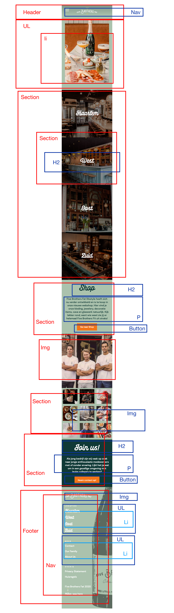
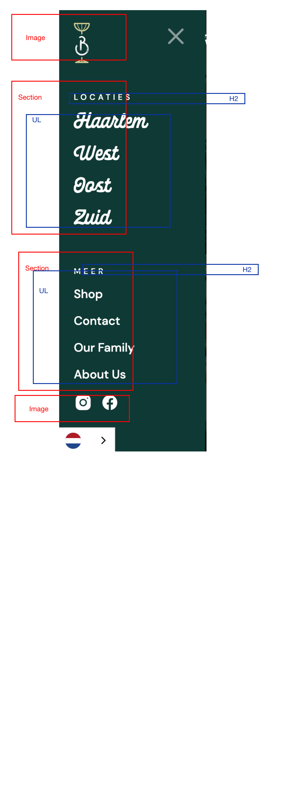
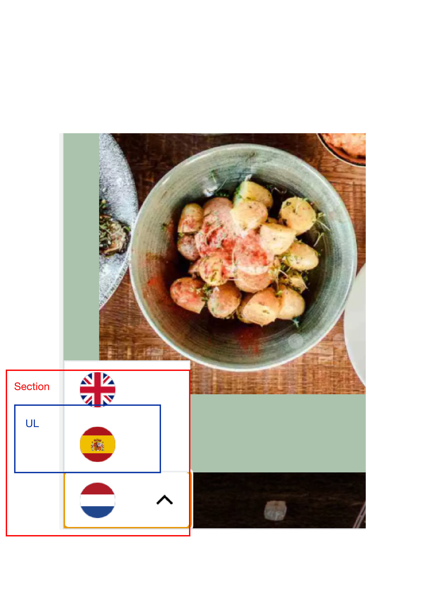
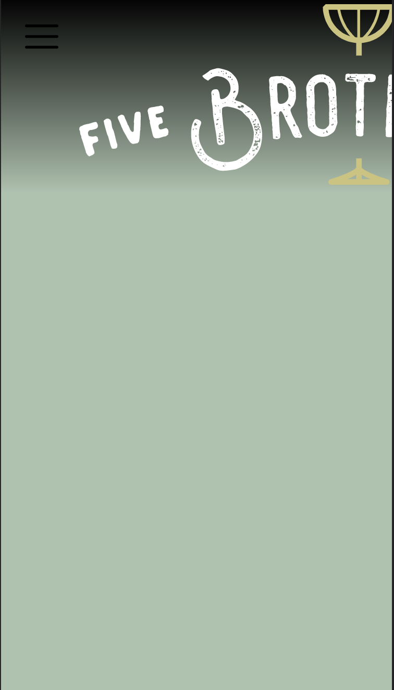
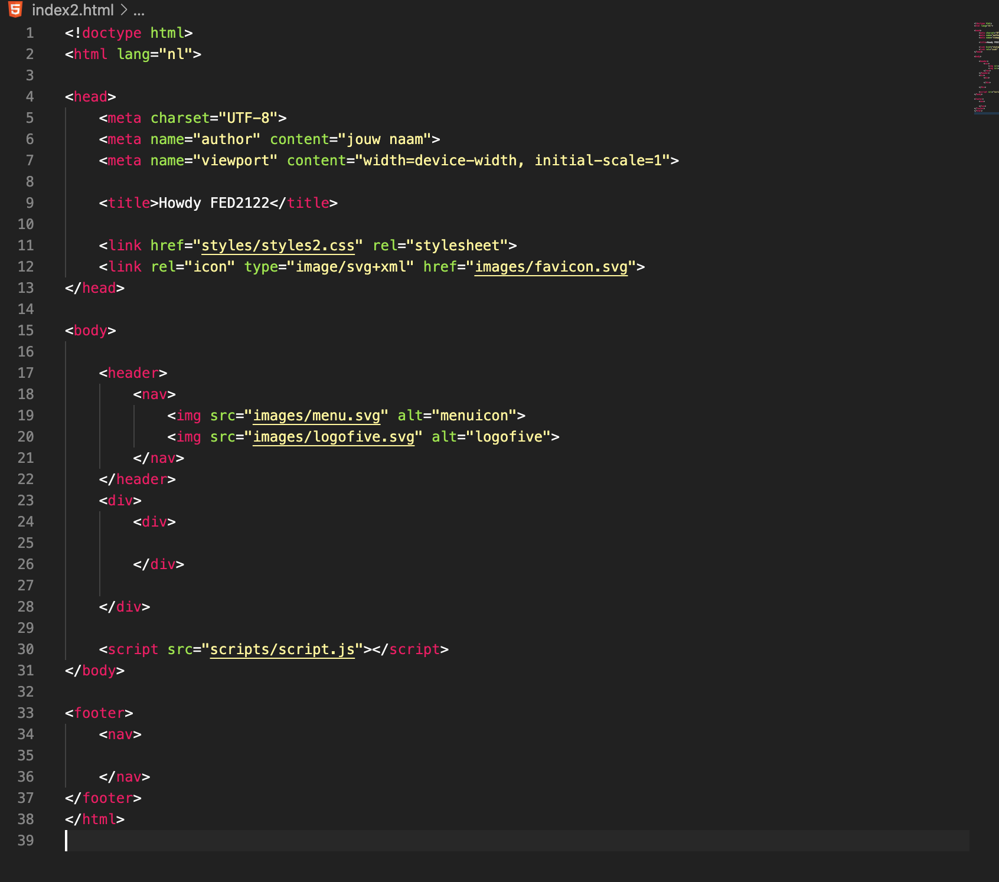
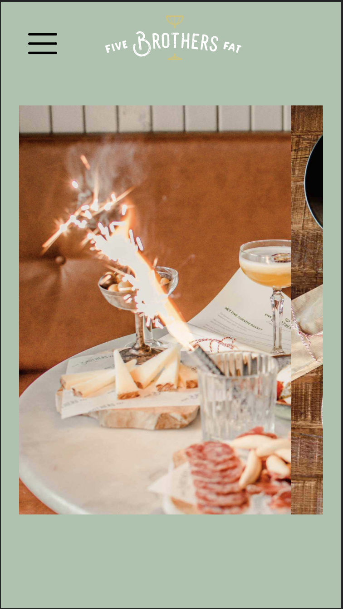
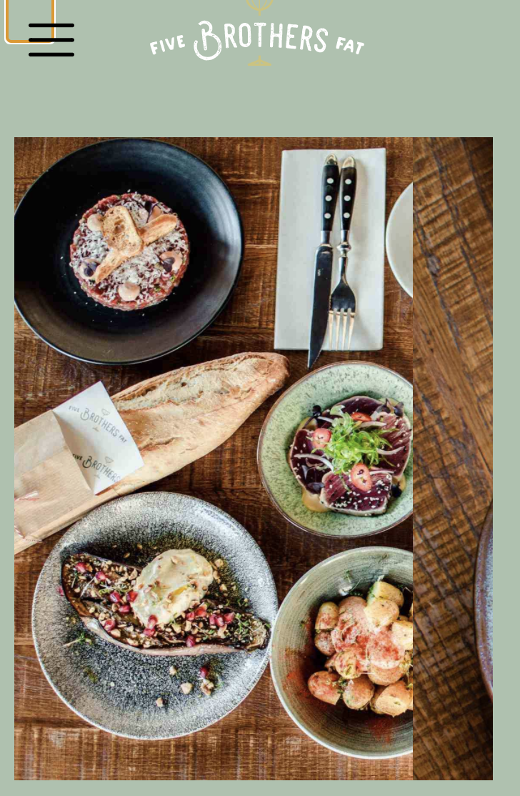

# Procesverslag
Markdown is een simpele manier om HTML te schrijven.  
Markdown cheat cheet: [Hulp bij het schrijven van Markdown](https://github.com/adam-p/markdown-here/wiki/Markdown-Cheatsheet).

Nb. De standaardstructuur en de spartaanse opmaak van de README.md zijn helemaal prima. Het gaat om de inhoud van je procesverslag. Besteedt de tijd voor pracht en praal aan je website.

Nb. Door *open* toe te voegen aan een *details* element kun je deze standaard open zetten. Fijn om dat steeds voor de relevante stuk(ken) te doen.

## Jij

uitwerken voor kick-off werkgroep

### Auteur:
Elston Barrow

#### Je startniveau:
Rood

#### Je focus:
Surface plan
 

## Je website

uitwerken voor kick-off werkgroep

### Je opdracht:
link naar de website die je gaat namaken óf de naam/omschrijving van je eigen ontwerp
 https://www.fivebrothersfat.nl/

#### Screenshot(s) van de eerste pagina (small screen): 
Five Brothers Fat 

#### Screenshot(s) van de tweede pagina (small screen):
hier de naam van de pagina  

 

## Breakdownschets (week 1)

uitwerken na afloop 2e werkgroep

### de hele pagina: 

### dynamisch deel (bijv menu): 

### wellicht nog een dynamisch deel (bijv filter): 

## Voortgang 1 (week 2)

uitwerken voor 1e voortgang

### Stand van zaken
hier dit ging goed & dit was lastig (neem ook screenshots op van delen van je website en code)

Ik heb een goede start kunnen maken aan de html en een beetje css. Ook heb ik bijna alle materialen zoals images al klaarstaan.

### Agenda voor meeting
samen met je groepje opstellen

Elston : Zou wat meer willen weten over hoe je en font-family die je hebt gedownload kan toepassen op de website.

### Verslag van meeting
hier na afloop snel de uitkomsten van de meeting vastleggen

Het is verstandig dat eerst de html codes worden gemaakt voordat er aan de css word begonnen.

## Voortgang 2 (week 3)

uitwerken voor 2e voortgang

### Stand van zaken
hier dit ging goed & dit was lastig (neem ook screenshots op van delen van je website en code)

Ik heb de afbeelding in een soort carrousel kunnen stoppen. Met behulp van Sanne gaat de slides als je ze op de helft zet automatisch naar de volgende.

Ik moet nog wel kijken hoe ik die carrousel automatisch kan laten sliden.

### Agenda voor meeting
samen met je groepje opstellen

| student 1      | student 2          | student 3    | student 4        |
| ---            | ---                | ---          | ---              |
| dit bespreken  | en dit             | en ik dit    | en dan ik dat    |
| en dat ook nog | dit als er tijd is | nog een punt | dit wil ik zeker |
| ...            | ...                | ...          | ...              |

### Verslag van meeting
hier na afloop snel de uitkomsten van de meeting vastleggen

Student 1 vraagt zich af wanneer je het beste grid of flex kunt gebruiken.
Student 2 vraagt zich af wat de beste manier is om grid te gebruiken in een layout.
Student 3 vraagt zich af hoe de carrousel automatisch gaat kunnen lopen.

## Toegankelijkheidstest (week 4)

uitwerken na test in 8e voortgang

### Bevindingen
Lijst met je bevindingen die in de test naar voren kwamen:

1 Afbeeldingen zijn niet klikbaar.
2 Sommige zinnen worden afgekapt.
3 Er kunnen misschien wat meer feedback komen van de states.

#### Afbeeldingen
Hier korte omschrijving (met indien nodig een afbeelding)

De afbeeldingen bovenaan de pagina zijn niet klikbaar. 

Hier een omschrijving van hoe het opgelost kan worden (met indien nodig een afbeelding)

De afbeeldingen een link te geven of als je op de afbeelding klikt feedback geven dat het niet klikbaar is.

#### Zinnen afgekapt
Hier korte omschrijving (met indien nodig een afbeelding)

De screenreader kapt sommige zinnen af tijdens het lezen.

Hier een omschrijving van hoe het opgelost kan worden (met indien nodig een afbeelding)

Ik heb geen flauw idee hoe dit opgelost kan worden.

#### Titel volgende bevinding. 
Hier korte omschrijving (met indien nodig een afbeelding)

Hier een omschrijving van hoe het opgelost kan worden (met indien nodig een afbeelding)

#### Titel nog een bevinding. 
Hier korte omschrijving (met indien nodig een afbeelding)

Hier een omschrijving van hoe het opgelost kan worden (met indien nodig een afbeelding)

## Voortgang 3 (week 4)

uitwerken voor 3e voortgang

### Stand van zaken
hier dit ging goed & dit was lastig (neem ook screenshots op van delen van je website en code)

Ik was heel slordig aan het coderen. Er wordt daarmee bedoelt dat ik weinig comments had in mijn css en ik gebruikte onnodige button elementen. Ook had ik moeite met de menu balk, maar dat is na een lange tijd gelukkig gelukt.

Het stylen van de pagina ging wel soepel, alleen had ik soms best wat moeite met nth-of-type te gebruiken soms.

### Agenda voor meeting
samen met je groepje opstellen

Elston : zou graag ondersteuning willen hebben voor de javascript en wilt wat meer weten over keyframes.

### Verslag van meeting
hier na afloop snel de uitkomsten van de meeting vastleggen

Minder onnodige elementen gebruiken in de documenten en de css met comments verdelen.

## Eindgesprek (week 5)

uitwerken voor eindgesprek

### Stand van zaken
hier dit ging goed & dit was lastig (neem ook screenshots op van delen van je website en code)

### Screenshot(s)

hier screenshot(s) van je eindresultaat

## Bronnenlijst

continu bijhouden terwijl je werkt

Nb. Wees specifiek ('css-tricks' als bron is bijv. niet specifiek genoeg).

1. https://codepen.io/shooft/pen/oNzGJMM voor de carrousel
2. 
Icons made by <a href="https://www.freepik.com" title="Freepik">Freepik</a> from <a href="https://www.flaticon.com/" title="Flaticon">www.flaticon.com</a>

3. 
Icons made by <a href="https://www.freepik.com" title="Freepik">Freepik</a> from <a href="https://www.flaticon.com/" title="Flaticon">www.flaticon.com</a>

4. https://lukelowrey.com/css-variable-theme-switcher/

5. https://www.videvo.net/search/birds/clip_type/royalty-free-sound-effects/freeclips/yes/?is_ajax=true

